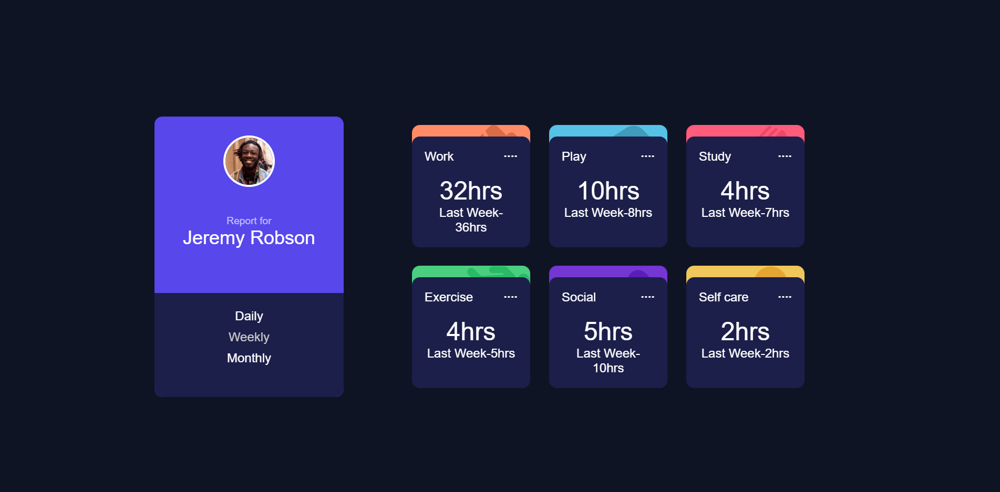

# Time Tracking Dashboard



This project is a responsive Time Tracking Dashboard built as a frontend challenge from Frontend Mentor. It allows users to view their time spent on various activities with daily, weekly, and monthly views.

## Features

- Responsive layout for mobile and desktop devices
- Switch between Daily, Weekly, and Monthly time tracking views
- Interactive hover states for all clickable elements
- Data driven from a local JSON file (`data.json`)

## Installation

1. Clone the repository:
   ```
   git clone <repository-url>
   ```
2. Open the project folder in your preferred code editor.

## Usage

- Open `index.html` in a web browser to view the dashboard.
- Use the timeframe buttons to switch between daily, weekly, and monthly stats.
- The dashboard layout adjusts automatically based on screen size.

## Technologies Used

- HTML5
- CSS3 (including Flexbox and Grid)
- JavaScript (for dynamic data rendering)

## Project Structure

- `index.html` - Main HTML structure of the dashboard
- `index.css` - Stylesheet for layout and design
- `data.json` - Local JSON data for activities and time tracking
- `design/` - Folder containing design reference images
- `images/` - Assets used in the project

## Author

## Maxmillin
